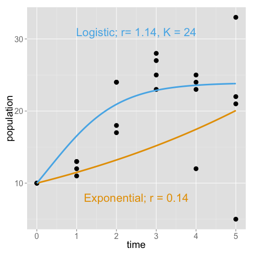
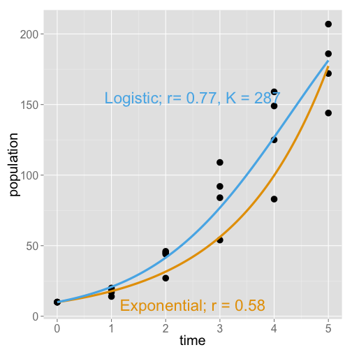

ASB
========================================================
author: Gabriel Herrick
date: 3/12/15

The Problem
========================================================

Florida uses Numeric Nutrient Criteria to determine impairement of waters. 
* If (N or P < NNC): unimpaired.
* If (N or P > NNC): check plant community

How do we use the plant community to determine impairment? 

Linear Vegetation Survey
========================================================
Basically, just a transect where you count all the species you see in each section. 

Two scores: 
1. Coefficient of Conservatism (C of C)
2. Florida Exotic Pest Plant Council (FLEPPC)

Too many "bad" plants = impaired. 

How are these scores determined? 

C of C scores
========================================================

Compare known impaired sites to known "healthy" sites. 

Correlate health with presence of plants. 

Low C of C: found more often than not in impaired sites

High C of C: found mostly in "healthy" sites.

Okay, so little alarm bells should be going off in your head...

Correlation is not Causation
===

Do increased nutrient levels shift communities to have higher abundances of plants with lower C of C scores? 

Does increasing nutrient concentration beyond NNC threshold result in changes to the plant community? 

Do individual plant species population dynamics change in response to increasing nutrient levels beyond NNC thresholds? 

Three species, three nutrient levels
===
Nutrient Levels | *Lemna valdiviana* | *Salvinia minima* | *Azolla caroliniana*
----------------|--------------------|-------------------|---------------------
Tap water       |                    |                   |       
Within NNC      |                    |                   |
NNC threshold   |                    |                   |    

What goes in the cells? 

Each species was grown in 4 containers for each treatment (12 total) for six weeks. 

We measured population size, wet weight, and % coverage. 

Predicting the future!
===

What happens to populations of the species when nutrient levels go from within NNC to the NNC treshold and beyond? 

As in the past, so in the future. 

Control: Tap Water
====
left:50%
 

***

```
       dAICc df weight
fit.lc 0.0   4  0.89  
fit.ec 4.1   3  0.11  
```


Low Nutrients: 0.188*NNC
===
 
***

```
            dAICc df weight
logistic    0.0   4  0.962 
exponential 6.4   3  0.038 
```


